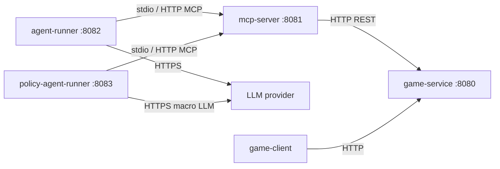

# Roguelike + MCP (Kotlin)

Играбельная roguelike с графикой (libGDX FPS-клиент), MCP API для LLM-агентов и сравнением двух агентов на одинаковых сидах.

**Стек:** Kotlin, Ktor, Gradle, Docker Compose, MCP (stdio / HTTP-мост), Ollama / YandexGPT.

## Быстрый старт

```bash
cp .env.example .env
./scripts/docker-build.sh
docker compose up
```

Поднимаются `game-service` (:8080), `mcp-server` (:8081), `agent-runner` (:8082). Играть руками: `./gradlew :game-client:run` (WASD, мышь, Esc).

Профиль `policy-agent` добавляет второй агент на :8083. Профиль `llm` — Ollama в Docker.

## Архитектура



| Сервис | Ответственность |
|--------|-----------------|
| **game-service** | Движок: карта, state, бой, мобы, инвентарь |
| **mcp-server** | MCP tools, JSON-RPC, прокси к game-service |
| **agent-runner** | Пошаговый agent loop: LLM tool calling, budget, retry |
| **policy-agent-runner** | Policy DSL: macro-LLM + micro-интерпретатор (второй агент для сравнения) |
| **game-client** | 2.5D raycasting-клиент (desktop) |
| **shared** | DTO, TileMap, протокол, общие типы агентов |

Границы: `game-service` не знает про LLM; `mcp-server` не знает про LLM; агенты видят игру **только через MCP tools** (без прямого доступа к state).

Подробнее: [docs/architecture.md](docs/architecture.md).

## Игра

| Требование | Реализация |
|------------|------------|
| Графика | libGDX клиент, FPS raycasting (~60 FPS локально) |
| Герой: HP, инвентарь | HP, hotbar, инвентарь, ключи, оружие, патроны |
| Процедурная карта | Комнаты + коридоры, сиды, двухуровневые карты |
| 3+ типа мобов | `MELEE` (Rusher), `RANGED` (Shooter), `LLM_GUARD` (босс с LLM) |
| Бой | Стрельба, укрытия, урон, смерть моба/игрока, reinforcement |
| Победа / проигрыш | Сбор ключей + выход с этажа / HP ≤ 0 |

Дизайн механик: [docs/game-design.md](docs/game-design.md).

## Паттерны GoF (3+)

### Command

**Где:** `game-service/.../command/CommandRegistry.kt:6-10`, `CommandDispatcher.kt`

Каждое действие игрока/агента (`move_*`, `interact`, sync-ввод) — объект `GameCommand`, регистрируется в `CommandRegistry` и выполняется через `CommandDispatcher`. Новое действие = новая команда + одна строка в registry, без раздувания `GameSession`.

### State

**Где:** `game-service/.../phase/PhaseHandler.kt:18-28`, `PhaseRegistry.kt`

Фаза сессии (`EXPLORATION`, `COMBAT`, `LEVEL_COMPLETE`, …) определяет, какие команды допустимы. `PhaseHandler` валидирует и реагирует на переходы — правила фазы не размазаны по if/else в движке.

### Strategy

**Где:** `game-service/.../ai/RusherBehavior.kt:8-12`, `ShooterBehavior.kt`, `LlmGuardBehavior.kt:7-9`

Поведение моба инкапсулировано в `MobBehavior`. `MELEE`/`RANGED` — детерминированные стратегии; `LLM_GUARD` делегирует решение LLM через HTTP к `agent-runner` (с heuristic fallback).

### Factory

**Где:** `agent-runner/.../llm/LlmClientFactory.kt:56-96`, `game-service/.../level/LevelGeneratorFactory.kt:5`

`LlmClientFactory` выбирает клиента по `LLM_PROVIDER` без правки кода. `LevelGeneratorFactory` подставляет генератор уровня (тестовый / процедурный) по конфигу.

### Observer

**Где:** `game-service/.../event/GameEventBus.kt:6-18`

`GameEventBus` рассылает доменные события (`MobKilled`, `RoomCleared`, …) подписчикам — метрики, логи, расширения без связности с `GameSession`.

## AI-блок

### MCP-сервер

6 tools: `game_new_session`, `game_observe`, `game_act`, `game_sync`, `game_session_summary`, `game_list_actions`.

Контракт с JSON-схемами и примерами: [docs/mcp-contract.json](docs/mcp-contract.json), [docs/mcp-contract.md](docs/mcp-contract.md).

При невалидных аргументах MCP возвращает `isError: true` с текстом ошибки.

Отладка HTTP-моста:

```bash
curl http://localhost:8081/mcp/tools
curl -X POST http://localhost:8081/mcp/tools/call \
  -H "Content-Type: application/json" \
  -d '{"name":"game_list_actions","arguments":{}}'
```

### Agent loop (`agent-runner`)

- Подключается к MCP (`stdio` или `MCP_TRANSPORT=http`), получает tools, играет цикл observe → LLM tool call → act/sync.
- **Провайдеры LLM** (переключение через env, без правки кода): `heuristic`, `ollama`, `yandex`, `yandex-openai`.
- **Budget:** `maxSteps` в запросе + `AGENT_MAX_TOOL_CALLS` — жёсткий потолок tool calls на партию.
- **Graceful degradation:** retry с backoff → `HeuristicDecisionClient` (`KeyHuntPlanner`); loop detection в `ToolExecutor`; тесты на `FakeLlmClient` без реального API.

```bash
curl http://localhost:8082/health
curl -X POST http://localhost:8082/api/v1/agent/run \
  -H "Content-Type: application/json" \
  -d '{"seed":42,"maxSteps":200}'
```

### Policy DSL agent (`policy-agent-runner`) — второй агент

Macro-LLM генерирует JSON-политику (`objective` + rules); micro-интерпретатор исполняет её через MCP **без LLM на каждом шаге** — быстрее и стабильнее для длинных прогонов.

```bash
docker compose --profile policy-agent up
curl -X POST http://localhost:8083/api/v1/policy-agent/run \
  -H "Content-Type: application/json" \
  -d '{"seed":42,"maxSteps":1000}'
```

Tracker: http://localhost:8083/api/v1/policy-agent/tracker

Подробнее: [docs/policy-agent.md](docs/policy-agent.md).

### LLM-управляемые враги

Тип `LLM_GUARD`: `LlmGuardBehavior` вызывает `agent-runner` `/api/v1/mob/decide` (tool-style intent: chase / shoot / kite). При таймауте или ошибке — fallback на `ShooterBehavior`.

### Сравнение агентов

| Агент | Порт | Модель решений |
|-------|------|----------------|
| **agent-runner** (step) | 8082 | LLM на каждом шаге (tool call) |
| **policy-agent-runner** (DSL) | 8083 | LLM на старте + async replan; micro — код |

Оба агента играют через один MCP на **одинаковых сидах** (`seed` в `game_new_session`). Для eval: одинаковый `seed`, `maxSteps`, N прогонов; метрики — % побед, шаги, токены (из логов LLM), HP в финале.

## Модули

| Модуль | Порт | Назначение |
|--------|------|------------|
| `game-service` | 8080 | Игровой движок |
| `mcp-server` | 8081 | MCP + JSON-RPC |
| `agent-runner` | 8082 | Step agent |
| `policy-agent-runner` | 8083 | Policy DSL agent |
| `game-client` | — | libGDX клиент |
| `shared` | — | DTO, карта, общие типы |

## Локальная разработка

Требования: JDK 21 (Gradle подтянет toolchain через Foojay).

```bash
./gradlew check          # тесты + detekt + JaCoCo
./gradlew :game-service:run
./gradlew :game-client:run   # второй терминал
```

Agent-runner локально:

```bash
LLM_PROVIDER=heuristic MCP_TRANSPORT=http MCP_SERVER_URL=http://localhost:8081 \
  ./gradlew :agent-runner:run
```

Policy-agent локально:

```bash
LLM_PROVIDER=heuristic MCP_TRANSPORT=http MCP_SERVER_URL=http://localhost:8081 \
  ./gradlew :policy-agent-runner:run
```

## Docker

```bash
cp .env.example .env
./scripts/docker-build.sh
docker compose up
```

### Ollama

**Ollama на хосте (WSL/Linux):**

```bash
ollama serve && ollama pull qwen2.5:3b
# в .env: LLM_PROVIDER=ollama, OLLAMA_BASE_URL=http://host.docker.internal:11434
docker compose up
```

**Ollama в Docker:**

```bash
# LLM_PROVIDER=ollama, OLLAMA_BASE_URL=http://ollama:11434
docker compose --profile llm up
```

GPU (NVIDIA): `docker compose -f docker-compose.yml -f docker-compose.gpu.yml --profile llm up`

Проверка: `./scripts/check-ollama.sh`, `curl http://localhost:8082/health`

При `LLM_PROVIDER=ollama` step-agent вызывает одну модель (`OLLAMA_MODEL`) с retry; при исчерпании попыток — heuristic fallback. Policy-agent использует свою цепочку primary/fallback (`POLICY_OLLAMA_*`).

Healthchecks:

- http://localhost:8080/health — game-service
- http://localhost:8081/health — mcp-server
- http://localhost:8082/health — agent-runner
- http://localhost:8083/health — policy-agent-runner (`agentType=policy-dsl`)

## Переменные окружения

| Переменная | Сервис | Описание |
|------------|--------|----------|
| `LLM_PROVIDER` | agent-runner | `heuristic`, `ollama`, `yandex`, `yandex-openai` |
| `OLLAMA_BASE_URL` | agent-runner | URL Ollama |
| `OLLAMA_MODEL` | agent-runner | модель Ollama для step-agent |
| `LLM_REQUEST_TIMEOUT_MS` | agent-runner | таймаут LLM (default 120000) |
| `AGENT_MAX_TOOL_CALLS` | agent-runner | budget tool calls |
| `AGENT_RETRY_ATTEMPTS` | agent-runner | retry перед heuristic fallback |
| `POLICY_LLM_PROVIDER` | policy-agent | `ollama` / `heuristic` |
| `POLICY_OLLAMA_MODEL` | policy-agent | модель macro-политики |
| `MOB_DECIDE_TIMEOUT_MS` | game-service | таймаут LLM-босса |
| `GAME_SERVICE_URL` | mcp-server | URL game-service |
| `LLM_API_KEY`, `YANDEX_FOLDER_ID` | agent-runner | YandexGPT |
| `MCP_TRANSPORT`, `MCP_SERVER_URL` | агенты | `stdio` или `http` |
| `HOST_PORT_*` | compose | проброс портов |

Полный список: [.env.example](.env.example).

## CI

GitHub Actions (`.github/workflows/ci.yml`): на push/PR в `main`/`master` — `./gradlew check jacocoRootReport`.

## Использование AI при разработке

| Область | AI (Cursor / LLM) | Ручная доработка |
|---------|-------------------|------------------|
| Каркас Gradle-модулей, Ktor routes | стартовые заготовки | wiring, healthchecks, Docker |
| MCP tools и контракт | черновики схем | валидация аргументов, интеграция с game-service |
| Agent loop, policy DSL | прототипы промптов и парсеров | budget, loop detection, replan-триггеры, тесты |
| Игровой движок / бой | идеи по структуре | баланс, reinforcement, FPS sync, все unit-тесты |


## Документация

- [docs/game-design.md](docs/game-design.md) — механики и core loop
- [docs/game-engine.md](docs/game-engine.md) — симуляция vs рендер
- [docs/game-service-architecture.md](docs/game-service-architecture.md) — слои движка
- [docs/policy-agent.md](docs/policy-agent.md) — policy DSL agent
- [docs/architecture.md](docs/architecture.md) — сервисы и деплой
- [docs/mcp-contract.json](docs/mcp-contract.json) — MCP контракт
