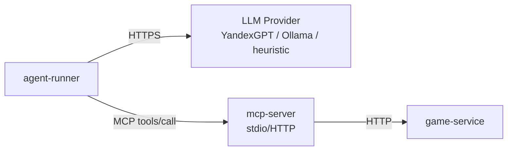

## AI Agent (agent-runner)

### Обзор
`agent-runner` – это Kotlin-сервис, который управляет игровым персонажем через MCP-инструменты. Он реализует классический **agent loop**: наблюдение → LLM-вызов → выполнение инструмента → обработка результата.

### Поддерживаемые LLM-провайдеры
| `LLM_PROVIDER` | Описание                                                                           | Требуемые переменные |
|----------------|------------------------------------------------------------------------------------|----------------------|
| `yandex` | YandexGPT (pro, light) через собственное API яндекс облако (Не OpenAI совместимое) | `LLM_API_KEY`, `YANDEX_FOLDER_ID` |
| `ollama` | Локальная модель через Ollama (например, Qwen)                                     | `OLLAMA_MODEL_URL` (по умолчанию `qwen2.5:3b`) |
| `yandex-openai` | OpenAI совместимый клиент, использовался для модели Qwen3.6-35B.                   | `LLM_API_KEY`, `YANDEX_FOLDER_ID` |
| `heuristic` | Эвристический планировщик (BFS по ключам) – не требует API                         | – |

Переключение происходит через переменную окружения:
```bash
export LLM_PROVIDER=yandex
```

### Архитектура блока

###### Ключевые компоненты внутри agent-runner:

AgentLoop – главный цикл:
game_new_session → ( game_observe → LLM → tools/call ) × N → завершение.
Отвечает за бюджет, остановку при победе/поражении, логирование.

LlmClientFactory – фабрика, создающая клиент для выбранного провайдера.
Поддерживает yandex, yandex-openai, ollama, heuristic.
При ошибках автоматически переключается на heuristic (fallback).

ToolExecutor – выполняет MCP-вызовы, отслеживает зацикливание (позиция не меняется 3 шага или одно действие повторяется 10 раз) и применяет эвристическое действие для выхода из тупика.

MobDecisionService – отдельный сервис для LLM-управляемых мобов (тип LLM_GUARD).
Имеет собственный бюджет (MOB_MAX_TOOL_CALLS) и также падает на эвристику при превышении.

###### Тестирование

- **Юнит-тесты:** `./gradlew :agent-runner:test` – используют `FakeLlmClient` и `MockMcpClient`, не требуют реальных API.

### Бюджет и защита от зацикливания
| Параметр        | Значение по умолчанию | Описание                                             |
|-----------------|-----------------------|------------------------------------------------------|
| `AGENT_MAX_TOOL_CALLS`        | 500                   | Жёсткий лимит шагов (запросов к LLM) на одну партию. |
| `MOB_MAX_TOOL_CALLS`        | 30                    | Лимит запросов к LLM для моба.                   |
| `AGENT_RETRY_ATTEMPTS` | 3                     |    Число повторных попыток при ошибке LLM (с экспоненциальным backoff).                                                  |

Отдельно стоит сказать, что бюджет в AgentLoop (`AGENT_MAX_TOOL_CALLS`) относится не к вызовам инструментов, а именно к запросам к LLM. Реализован механизм обработки множества вызовов инструментов от LLM, то есть агент может за один раз ответить вызовом нескольких инструментов. В ToolExecutor такой случай будет считаться одним шагом из бюджета.

### Запуск
Предусловие для запуска: запущены game-service и mcp-server.\
Пример для Qwen3.6-35B в Яндекс облаке:
```bash
export LLM_PROVIDER=yandex-openai
export LLM_API_KEY={Ваш ключ}
export YANDEX_FOLDER_ID={Ваш идентификатор каталога}
docker compose up agent-runner
```

Запрос на запуск игры агентом:
```bash
curl -X POST http://localhost:8082/api/v1/agent/run \                                                                                                                                                                          ─╯
  -H "Content-Type: application/json" \
  -d '{"seed": 42, "maxSteps":1}'

```

Запрос для игры в кооп режиме (вместе с агентом):
```bash
./gradlew :game-client:run
#Id сессии берется либо из клиента, либо из логов game-service

curl -X POST http://localhost:8082/api/v1/agent/run \                                                                                                                                                                          ─╯
  -H "Content-Type: application/json" \
  -d '{"seed": 42, "maxSteps":5, "sessionId": "{Id сессии}" }'

```