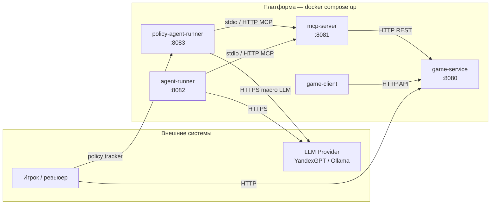

# Архитектура Roguelike + MCP

## Диаграмма сервисов



## Границы ответственности

| Сервис | Знает о | Не знает о |
|--------|---------|------------|
| **game-service** | Карта, state, бой, мобы | LLM, MCP, агенты |
| **mcp-server** | MCP tools, JSON-RPC, HTTP к game-service | LLM, внутренний state вне публичного API |
| **agent-runner** | LLM-клиент, retry, budget, логи tool calls, MCP | Внутренний state игры (только tools) |
| **policy-agent-runner** | Policy DSL: macro LLM + micro interpreter, MCP | Внутренний state игры (только tools) |

## Транспорты

| Связь | Протокол | Реализация |
|-------|----------|------------|
| agent-runner / policy-agent → mcp-server | stdio MCP | `MCP_SERVER_COMMAND` в Docker; локально — `./gradlew :mcp-server:run --args=stdio` |
| agent-runner / policy-agent → mcp-server | HTTP MCP | `MCP_TRANSPORT=http`, `MCP_SERVER_URL` — тесты и отладка |
| mcp-server → game-service | HTTP REST | `GameServiceClient` → `/api/v1/sessions` |
| agent-runner → LLM | HTTPS | `LLM_PROVIDER=heuristic\|ollama\|yandex\|yandex-openai` |
| policy-agent → LLM | HTTPS | `POLICY_LLM_PROVIDER=ollama\|heuristic` |
| game-client → game-service | HTTP REST | sync ~20 Hz, snapshot JSON |

## Деплой

```bash
cp .env.example .env
./scripts/docker-build.sh
docker compose up
```

Профиль `policy-agent` — второй агент на :8083. Профиль `llm` — Ollama в контейнере.

Порядок старта: `game-service` → `mcp-server` → `agent-runner` / `policy-agent-runner` (healthcheck + `depends_on`).

## Опциональные сервисы (бонус курса)

- `web-dashboard` — визуализация матчей
- `logger` — централизованные логи tool calls
- `replay-service` — воспроизведение по сиду
- `event-bus` — события боя для аналитики
