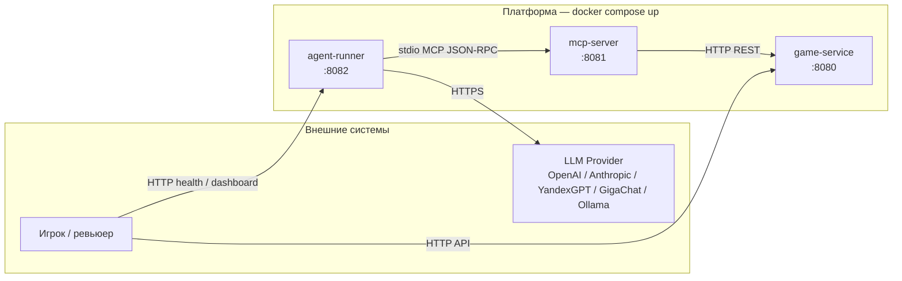

# Архитектура Roguelike + MCP

## Диаграмма сервисов



## Границы ответственности

| Сервис | Знает о | Не знает о |
|--------|---------|------------|
| **game-service** | Карта, state, бой, мобы | LLM, MCP, агенты |
| **mcp-server** | MCP tools, JSON-RPC, HTTP к game-service | LLM, внутренний state вне публичного API |
| **agent-runner** | LLM-клиент, retry, budget, логи tool calls, MCP | Внутренний state игры (только tools) |

## Транспорты (этап 1 — заглушки)

| Связь | Протокол | Реализация сейчас |
|-------|----------|-------------------|
| agent-runner → mcp-server | stdio MCP | Конфиг `MCP_SERVER_COMMAND`; HTTP-эндпоинты mcp-server для интеграционных тестов |
| mcp-server → game-service | HTTP REST | `GameServiceClient` → `/api/v1/sessions` |
| agent-runner → LLM | HTTPS | `LLM_PROVIDER=stub`, ключ через `LLM_API_KEY` |

## Деплой

```bash
docker compose up --build
```

Порядок старта: `game-service` → `mcp-server` → `agent-runner` (healthcheck + `depends_on`).

## Опциональные сервисы (бонус, не в шаблоне)

- `web-dashboard` — визуализация матчей
- `logger` — централизованные логи tool calls
- `replay-service` — воспроизведение по сиду
- `event-bus` — события боя для аналитики
