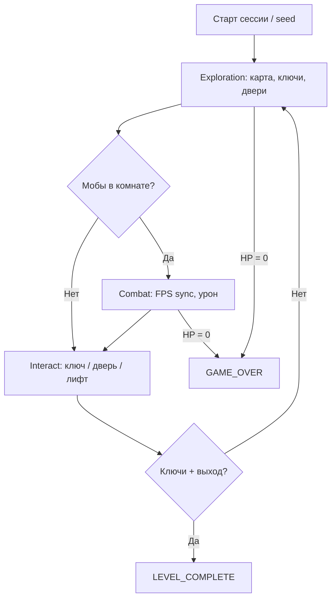

# Геймдизайн: реализованные механики

Roguelike для курсового проекта (MCP-агенты, сиды, микросервисы). Документ описывает **то, что есть в коде**, а не backlog.

Связанные документы:

- [architecture.md](architecture.md) — сервисы и деплой
- [mcp-contract.json](mcp-contract.json) — API для агентов
- [game-engine.md](game-engine.md) — симуляция и клиент
- [policy-agent.md](policy-agent.md) — второй агент

---

## Питч

**FPS roguelike на процедурной карте:** сбор ключей, комнаты с мобами, выход с этажа. Между комнатами — exploration; в бою — стрельба, укрытия, reinforcement при затянутом зачисте.

---

## Core loop (как играется)

---

## Герой

| Параметр | Реализация |
|----------|------------|
| **HP** | смерть при ≤ 0 |
| **Позиция** | `PlayerPose` (float x/y, yaw, pitch) |
| **Инвентарь** | слоты, Tab-управление, drop |
| **Hotbar** | 2 слота оружия, reload из инвентаря |
| **Ключи** | `keysCollected` / `keysRequired`, interact на ключах |
| **Патроны** | loaded + reserve, reload, расход при стрельбе |

---

## Карта и контент

- Процедурная генерация: комнаты, коридоры, сиды; опция `twoLevel` (два этажа).
- Типы тайлов: стены, двери (`ROOM_SEAL`, loot-двери), ключи, выход, **лава** (урон), **колонны**, **лифт**.
- Fog-of-war для policy-agent: только известные клетки в brief LLM (без читов).

---

## Мобы (3 типа)

| Тип | Поведение | Роль |
|-----|-----------|------|
| **MELEE (Rusher)** | сближение | давление в ближнем бою |
| **RANGED (Shooter)** | дистанция, укрытия | перестрелка |
| **LLM_GUARD** | HTTP → `agent-runner` `/mob/decide` | босс; fallback на Shooter |

Поведение rule-based в `game-service`; LLM — только для `LLM_GUARD`.

---

## Бой

- FPS sync: aim (yaw/pitch), fire, reload, strafe, jump.
- Урон игроку и мобам; смерть моба удаляет entity.
- **Reinforcement:** `RoomEngagementSystem` — таймер комнаты; при затянутой зачистке без clear — подкрепление.
- Баланс мобов vs игрок: отдельные константы урона/кулдауна для PvE.

---

## Победа и поражение

| Исход | Условие |
|-------|---------|
| **Поражение** | HP ≤ 0 |
| **Победа этажа** | все ключи собраны + interact на выходе (`LEVEL_COMPLETE`) |

---

## MCP и агенты

Агент видит игру через tools ([mcp-contract.json](mcp-contract.json)):

- `game_observe` — snapshot (карта, HP, ключи, мобы, phase).
- `game_act` / `game_sync` — те же команды, что и у игрока.

Два агента для сравнения на одном `seed`:

| Агент | Решения |
|-------|---------|
| **agent-runner** | LLM tool call каждый шаг (или heuristic `KeyHuntPlanner`) |
| **policy-agent-runner** | macro-LLM (objective + rules) + micro-планировщики |

---

## История решений

| Дата | Решение |
|------|---------|
| 2026-05 | Микросервисы + MCP stdio |
| 2026-05 | FPS raycast клиент + server-authoritative sync |
| 2026-06 | Policy DSL agent (v4 objective) как второй агент |
| 2026-06 | agent-runner откатан к step-agent (ветка llm-boss); policy-agent — основной LLM-агент |
