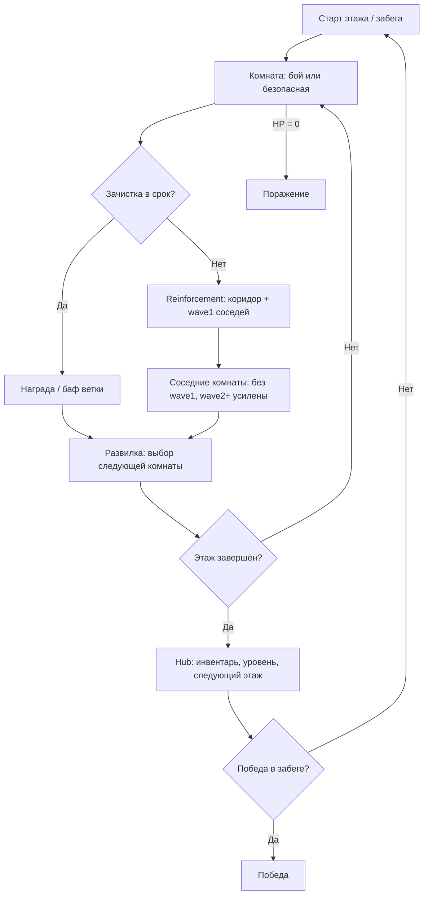

# Геймдизайн: обзор механик и геймплея

Документ фиксирует **текущее видение** roguelike для курсового проекта (MCP-агенты, сиды, 3 микросервиса). Это не финальный GDD — раздел **«Открытые вопросы»** перечисляет, что ещё нужно решить.

Связанные документы:

- [architecture.md](architecture.md) — сервисы и деплой
- [mcp-contract.json](mcp-contract.json) — API для агентов
- [game-engine.md](game-engine.md) — свой движок на Kotlin, рендер, ассеты

---

## Питч (одна фраза)

**Roguelike с RE-подготовкой между комнатами и doom-давлением внутри боя:** игрок выбирает путь по этажу, зачищает комнаты по шаблонам, а затянутый бой перераспределяет угрозу — подкрепления из коридоров и «первых волн» соседних комнат.

---

## Обязательные требования курса (чеклист)

| Требование | Планируемая реализация |
|------------|------------------------|
| Герой: HP, инвентарь, уровни | HP + сетка/слоты инвентаря; уровень даёт пассивки между этажами |
| Процедурная карта (комнаты + коридоры) | Граф этажа → тип комнаты → шаблон геометрии |
| 3+ типа мобов с разным поведением | Rusher, Shooter, Elite (+ опционально LLM-страж) |
| Бой: атака, защита, урон, смерть | Encounter в комнате; смерть моба/героя |
| Условие победы / проигрыша | Выход с этажа / ключ + босс; проигрыш при HP ≤ 0 |

---

## Core loop



**Ось решений:** куда идти на развилке (риск/награда) × как быстро закончить бой (патроны vs reinforcement vs усиленные соседи).

---

## Макро-слой: этаж и выбор комнат

### Граф этажа

- **Узлы** — комнаты (тип + шаблон + состояние волн).
- **Рёбра** — коридоры (0–2 «коридорных» моба на ребро).
- Финал этажа — **большой зал** с несколькими входами (читаемые reinforcement).

### Развилка после комнаты

Игрок видит **2–3 варианта** следующей локации (на MVP — 2):

| Тип | Обещание | Типичный риск |
|-----|----------|----------------|
| **Arena** | опыт, ключевой лут | много мобов, reinforcement |
| **Treasury** | предметы, оружие | засада |
| **Clinic / Shrine** | хил, max HP | цена (слот, дебаф на этаж) |
| **Armory** | выбор 1 из 3 оружий/модов | крупный предмет в сетке |
| **Storage** | расширение инвентаря | слабый бой, редкий баф |
| **Quiet** | меньше reinforcement N комнат | мало лута |

На развилке показывать **подсказки** (иконка + 1 правило), иначе выбор неинформативен.

### Бафы за комнаты / ветки

Бафы привязать к **типу выбранной ветки** (не смешивать на MVP с S-rank за скорость):

| Баф | Частота | Заметки |
|-----|---------|---------|
| +ряд/слоты инвентаря | редко (1–2 за забег) | не ломает все дилеммы RE |
| +урон типа оружия / мод | средне | на этаж или N комнат |
| +max HP / хил | средне | Clinic-ветка |
| «Тихий этаж» (−reinforcement) | редко | Quiet-ветка |

---

## Микро-слой: бой и tempo

### Фаза боя vs фаза подготовки

| Фаза | Действия | Темп |
|------|----------|------|
| **Между комнатами / в безопасной зоне** | сетка инвентаря, загрузка оружия, развилка | медленный (RE) |
| **В активном encounter** | движение, стрельба, быстрый слот (хил), укрытия | быстрый (doom-like) |

**Не открывать полную сетку инвентаря во время перестрелки** — только hotbar (1–2 слота).

### Патроны и ресурсы

- Патроны — **бюджет этажа** (хватает на ~8–12 «серьёзных» боёв), не бесконечный дроп с каждого трупа.
- Мелкий лут (патроны) — **автостак** или 1–2 слота; в сетке — оружие, хил, ключи, особые предметы.
- Обход и ближний бой — валидны, но не обязательны.

### Reinforcement (вместо абстрактного «шума»)

**Триггер:** `elapsedFight > expectedClearTime × k` (ступени: 1.2×, 1.5×, 2.0×).

`expectedClearTime` (черновик):

```text
expectedClearTime = base(roomType)
  + perMob × mobCount
  + perWave × (waves - 1)
  + eliteBonus
```

**Источники подкрепления:**

1. **Коридорные мобы** на рёбрах, смежных с текущей комнатой (cap за эпизод).
2. **Только wave1** соседних открытых/«слышащих» комнат (один раз с комнаты за этаж).

**Компенсация баланса:**

- В комнате, отдавшей wave1: при входе **нет первой волны**, но **wave2+** с множителем (HP, +1 моб) — **cap** множителя (например ×1.5).
- Статус комнаты: `Alerted` — видно в UI / в `game_observe` для агентов.

**Контроль эксплойтов** (выбрать 1–2 на реализацию):

- wave1 приходит в бой с пониженным HP (не «бесплатное опустошение» соседа);
- лимит: с соседа wave1 уходит только один раз за этаж;
- «пустая» комната — короткий переход + элита вместо пустоты.

---

## Процедурная генерация

### Пайплайн

1. Сгенерировать **граф этажа** (число комнат, развилки, путь к залу).
2. Назначить **типы** комнат на узлы (с учётом развилок игрока).
3. Для каждого узла — **шаблон** + валидация.
4. Расставить **волны** мобов по ролям шаблона.

### Шаблоны (MVP — 4–6, цель — 8+)

| ID | Суть | Якоря / constraints |
|----|------|---------------------|
| `CORRIDOR_AMBUSH` | узкий проход | cover, 1–2 spawn |
| `ARENA_OPEN` | открытый зал | несколько входов, много cover |
| `HAZARD_LAVA` | лава + **лифт** в ≤4 тайлах | проходимый путь entrance→exit |
| `TREASURE_TRAP` | лут + засада | |
| `SHRINE` | баф за цену | |
| `ARMORY_CHOICE` | выбор 1 из 3 | |
| `BOSS_GATE` | финал этажа | |

Шаблон = размер + обязательные тайлы + точки спавна + правила валидации (см. [game-engine.md](game-engine.md) — данные уровня).

---

## Герой

| Параметр | Описание |
|----------|----------|
| **HP** | смерть при ≤ 0 |
| **Уровень** | между этажами: выбор 1 пассивки из 3 |
| **Инвентарь** | сетка слотов (RE-стиль); редкое расширение |
| **Hotbar** | быстрый хил / смена оружия в бою |
| **Оружие** | занимает слоты; типы: ближнее / пистолет / дробовик (пример) |

---

## Мобы (минимум 3 типа)

| Тип | Поведение | Роль в системе |
|-----|-----------|----------------|
| **Rusher** | сближается с ближайшего входа | давит tempo |
| **Shooter** | дальняя позиция, укрытия | наказывает стояние |
| **Elite** | много HP, медленный | съедает бюджет патронов; wave2+ / reinforcement |
| **LLM Guard** (опционально) | решения по короткому контексту | у выхода зала; курс «LLM-мобы» |

Поведение rule-based в `game-service`; LLM — только для отдельного архетипа через внешний вызов (не в hot path каждого тика).

---

## Победа и поражение

| Исход | Условие |
|-------|---------|
| **Поражение** | HP героя ≤ 0 |
| **Победа этажа** | ключ + активация выхода / зачистка зала |
| **Победа забега** | N этажей или финальный босс (число этажей — TBD) |

Избегать soft-lock «нет патронов и нет выхода»: всегда валидный путь (нож, слабые коридорные мобы, гарантированный минимум патронов на этаже).

---

## Связь с MCP и AI-агентами

Агент **не видит** полный внутренний state — только tools ([mcp-contract.json](mcp-contract.json)).

Рекомендуемое развитие `game_observe`:

- видимая комната (fog-of-war);
- HP, патроны (агрегат), hotbar;
- **развилка:** `choices[]` с типом и hint;
- **бой:** `overtimeRatio`, `adjacentThreats` (corridor / wave1 available);
- статусы соседних комнат: `Normal` | `Alerted` | `Cleared` (без полного спойлера лута).

Метрики для отчёта на одном сиде:

- глубина (этаж/комната);
- время / затянутые бои;
- патроны потрачены;
- причина смерти.

---

## Открытые вопросы (нужно решить)

### Геймплей

- [ ] **Пошаговый** vs **realtime** vs **realtime + пауза между волнами** — влияет на scope и MCP-тики.
- [ ] **2D top-down** vs **3D** (см. [game-engine.md](game-engine.md)) — для курса разумнее 2D/псевдо-3D на MVP.
- [ ] Число этажей за забег и длина этажа (комнат).
- [ ] Точные константы `expectedClearTime` и пороги reinforcement.
- [ ] Один тип награды на развилке или смешивать с бонусом за быструю зачистку.
- [ ] Есть ли **hub** между этажами (перекладка инвентаря) или только безопасные комнаты.
- [ ] Идентификация предметов (как в RE) или сразу понятные иконки.

### Контент

- [ ] Полный список шаблонов и биомов/тем этажа.
- [ ] Таблица оружия и прогрессии уровня.
- [ ] Поведение LLM-моба: частота вызовов, бюджет токенов, fallback на rule-based.

### Техника / продукт

- [ ] Где живёт **рендер** (отдельный клиент vs встроенный в game-service) — см. engine doc.
- [ ] Формат реплея для отчёта по сидам.
- [ ] Нужен ли **web-dashboard** (бонус курса).

### Баланс

- [ ] Playtest-метрики: средняя длина этажа, % затянутых боёв, win rate.
- [ ] Кривая сложности по этажам.

---

## Рекомендуемый порядок реализации

1. **Headless симуляция** в `game-service`: граф, одна комната, бой, HP, смерть.
2. **Развилка + 2 шаблона** комнат.
3. **Инвентарь** (слоты + hotbar) и патронный бюджет.
4. **Reinforcement** по таймеру + состояние соседей.
5. **MCP observe/act** под реальный state.
6. **Клиент/рендер** (минимальная визуализация) — см. [game-engine.md](game-engine.md).
7. LLM Guard + сравнение агентов на сидах.

---

## История решений

| Дата | Решение |
|------|---------|
| 2026-05 | Core: развилки + шаблоны комнат + reinforcement вместо шкалы «шума» |
| 2026-05 | RE-между / doom-внутри; патроны как бюджет этажа |
| 2026-05 | Reinforcement только из wave1 соседей + коридор; wave2+ усилены |
