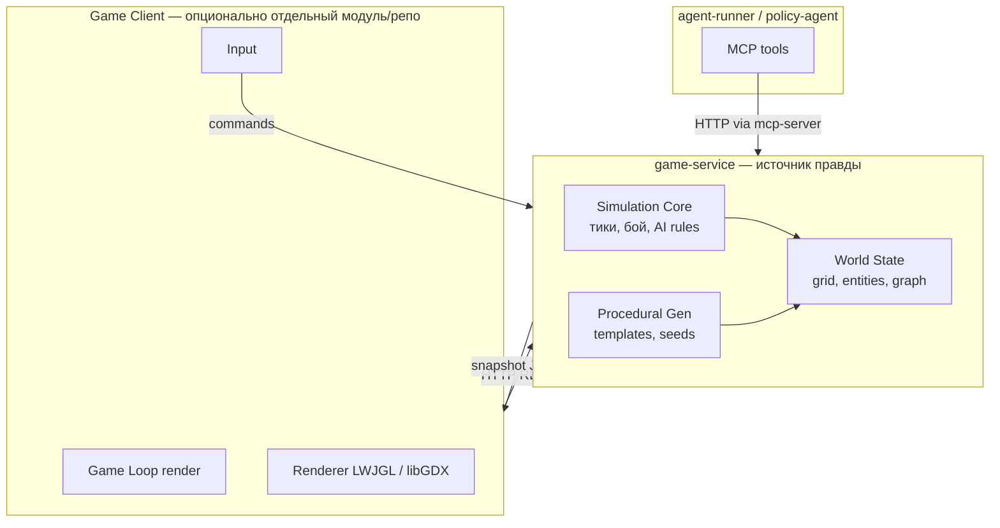

# Игровой движок на Kotlin: обзор

Документ описывает, **как строить свой движок** в контексте проекта: симуляция в `game-service`, визуализация отдельно, производительность, модели, текстуры, кастомизация.

Цель курса — **играбельная** игра с графикой и MCP, а не коммерческий AAA-движок. Приоритет: предсказуемая симуляция, тестируемость, сиды; рендер — достаточно хороший для top-down / лёгкого 3D.

---

## Разделение: симуляция vs рендер



**Правило:** вся логика победы, урона, reinforcement, инвентаря — только в `game-service`. Клиент рисует **снимок state** и отправляет **команды** (`move`, `shoot`, `use_slot`). Так MCP-агент и человек играют в одну и ту же симуляцию.

---

## Что значит «свой движок» здесь

Не обязательно писать OpenGL с нуля. Разумная декомпозиция:

| Слой | Свой код | Библиотека (типично) |
|------|----------|----------------------|
| **Simulation** | правила боя, волны, граф этажа, инвентарь | чистый Kotlin |
| **ECS-lite** (опционально) | Entity + Component + System | без обязательного фреймворка |
| **Процген** | шаблоны, валидация | Kotlin + JSON/YAML шаблоны |
| **Рендер** | камера, спрайты, тайлмап | **libGDX** или **LWJGL3** + мини-абстракция |
| **Ассеты** | загрузчик, атласы | TexturePacker / встроенное libGDX |
| **3D модели** (если нужны) | позиции, анимации | **gltf** через jMonkey или libGDX g3d |

**Рекомендация для MVP:** **2D top-down** (тайлы + спрайты) — быстрее, проще MCP (дискретная сетка), проще отладка. Псевдо-3D (billboards) — следующий шаг.

---

## Варианты стека на Kotlin

### 1. libGDX (рекомендуется для курса)

- Зрелый game loop, input, 2D/3D, texture atlases, Tiled.
- Desktop + при желании WebGL (GWT/Web) — опционально.
- Kotlin-first примеры в сообществе.

```kotlin
// Условная структура — не production API
class GameScreen(private val stateClient: GameStateClient) : ScreenAdapter() {
    override fun render(delta: Float) {
        val snapshot = stateClient.pollSnapshot()
        batch.begin()
        snapshot.entities.forEach { drawEntity(it) }
        batch.end()
    }
}
```

### 2. LWJGL3 + собственный тонкий слой

- Максимум контроля, больше кода (шейдеры, VBO, камера).
- Имеет смысл, если хотите именно «написать движок» как учебную цель.

### 3. Headless-only + веб-фронт (Compose Canvas / Pixi / Three.js)

- `game-service` отдаёт JSON; UI на JS/Compose.
- Плюс: CI без GPU; минус: «движок на Kotlin» только на сервере.

**Для курса:** **своя simulation в game-service + libGDX-клиент** в модуле `game-client`.

---

## Модель данных мира (для кода simulation)

```kotlin
// Концептуально — ориентир для реализации в game-service

data class GameSession(val seed: Long, val floor: FloorState, val player: PlayerState)

data class PlayerState(
    val hp: Int,
    val maxHp: Int,
    val level: Int,
    val inventory: InventoryGrid,
    val hotbar: List<ItemId?>,
    val ammo: AmmoPool,
    val position: GridPos,
)

data class FloorState(
    val graph: FloorGraph,
    val rooms: Map<RoomId, RoomState>,
    val currentRoomId: RoomId,
    val phase: FloorPhase, // EXPLORATION | COMBAT | CHOICE | HUB
)

data class RoomState(
    val templateId: String,
    val tiles: TileGrid,
    val wave1: MobPack?,      // null если COMMITTED / ушла
    val wave2Plus: MobPack,
    val alertLevel: AlertLevel,
    val fightTimer: FightTimer?,
)
```

Рендеру нужен **DTO-снимок** (`GameSnapshot`), без внутренних RNG и очередей AI.

---

## Производительность

### Simulation (game-service)

| Аспект | Подход |
|--------|--------|
| **Тики** | Фиксированный шаг (например 20–60 Hz) или пошаговый режим без realtime loop |
| **Путь AI** | Grid BFS/A* на маленьких картах (комната 32×32) — дёшево |
| **Коллизии** | Тайловая сетка, не физический движок |
| **Процген** | Генерация этажа один раз при входе; seed = воспроизводимость |
| **Параллелизм** | Один поток на сессию; Ktor coroutines для I/O |

Целевые цифры для курса: **тысячи** сущностей не нужны; **десятки** мобов на этаж — тривиально для JVM при отсутствии аллокаций в hot loop (object pools при необходимости).

### Рендер (клиент)

| Аспект | Подход |
|--------|--------|
| **Batching** | Texture atlas (один draw call на слой) |
| **Тайлмап** | Отрисовка чанками, не тайл-за-тайлом с текстурой |
| **UI инвентарь** | Отдельный ortho UI pass |
| **3D** | LOD не нужен; low-poly glTF, instancing для повторяющихся мобов |

**Узкое место проекта** — не Kotlin, а **LLM-вызовы** и сеть; симуляция должна оставаться детерминированной и быстрой.

---

## Текстуры и 2D-арт

### Пайплайн

1. Исходники: PNG (стены, пол, мобы, UI).
2. **TexturePacker** → один `.atlas` + `.png`.
3. libGDX `TextureAtlas` + `Animation` для спрайт-листов.

### Кастомизация скинов

- **Вариант A:** разные регионы в одном атласе (`hero_red`, `hero_blue`).
- **Вариант B:** overlay-слои (броня, оружие) отдельными спрайтами, стыкуются по anchor point.
- **Данные:** `appearance.json` → id текстур; сервер может отдавать только id, клиент резолвит.

Для MCP не важно, как выглядит герой — важны координаты и HP.

---

## 3D: модели и загрузка (если пойдёте в 3D)

| Формат | Плюсы | Kotlin |
|--------|-------|--------|
| **glTF 2.0** | стандарт, материалы, анимации | libGDX g3d, jMonkeyEngine |
| **OBJ** | просто | быстрый прототип, без анимаций |
| **Voxel / примитивы** | свой стиль | кубы в коде — вообще без DCC |

Загрузка (libGDX g3d, концепт):

```kotlin
val model = modelLoader.loadModel(Gdx.files.internal("models/rusher.g3db"))
val instance = ModelInstance(model, position.x, position.y, position.z)
modelBatch.render(instance, environment)
```

**Кастомизация 3D:** swap mesh parts (оружие отдельным submesh) или material variants (цвет альбедо).

**Совет:** для roguelike с видом сверху достаточно **billboard** (плоский квад с текстурой) в 3D-сцене — выглядит как 2.5D, проще чем скелетная анимация.

---

## Процедурные комнаты и «лава + лифт»

Шаблон хранить как **данные**, не как код:

```json
{
  "id": "HAZARD_LAVA",
  "size": [24, 24],
  "anchors": ["entrance", "exit", "lift"],
  "rules": [
    { "type": "hazard_fill", "tile": "lava", "minPercent": 0.15 },
    { "type": "place_near", "what": "lift", "near": "lava", "maxDistance": 4 },
    { "type": "path_exists", "from": "entrance", "to": "exit", "avoid": "lava" }
  ],
  "spawnPoints": ["entrance", "cover_north"]
}
```

Генератор:

1. Заполнить базовый пол.
2. Применить правила по порядку.
3. Если валидация failed — retry с тем же seed (детерминированный sub-seed).

Тайлы — `enum` + метаданные (проходимость, урон/тик, укрытие).

---

## Синхронизация клиент ↔ server

| Режим | Когда |
|-------|--------|
| **Server authoritative** | финал для MCP и мультиплеера в будущем |
| **Poll snapshot** 10–20 Hz | MVP, проще отладка |
| **WebSocket push** | если нужен плавный render |

Команды — идемпотентные где возможно (`actionId` + seq).

Клиент **интерполирует** позиции только для отображения; урон считает сервер.

---

## Тестирование без GPU

- Unit-тесты: бой, reinforcement, инвентарь, процген по seed.
- Golden tests: `seed=42` → hash снимка этажа.
- Headless CI уже есть (Gradle); клиент — отдельный job или manual.

---

## Структура модулей (текущая)

```text
roguelike/
  shared/                 # TileMap, GameSnapshot, FpsMovement, agent DTO
  game-service/           # api / application / domain / infrastructure
  game-client/            # libGDX FPS raycast
  mcp-server/
  agent-runner/           # step-agent (llm-boss)
  policy-agent-runner/    # policy DSL agent
```

Подробная схема движка: [game-service-architecture.md](game-service-architecture.md).

**MVP FPS (реализовано):**

| Термин | Значение |
|--------|----------|
| **2D** | Карта — сетка тайлов (логика на сервере). |
| **2.5D / псевдо-3D** | Отрисовка **raycasting** (как Doom): нет 3D-моделей, только вертикальные полосы стен. |
| **Полноценный 3D** | Меши + камера — не в MVP. |

- Позиция `PlayerPose` (float x/y, yaw, pitch).
- Клиент: **60 FPS** raycast локально + **prediction** (`FpsMovementSystem` в `shared`).
- Сеть: `POST …/sync` ~**20 Hz**, не запрос на каждый кадр.
- Управление: WASD, Q/E pitch, стрелки поворот, мышь — yaw.

Расширение: TextureAtlas для стен, звук, entity-спрайты в raycast-сцене.

---

## Связь с геймдизайном

| Механика | Компонент движка |
|----------|------------------|
| Процедурные комнаты | `LevelGenerator` + шаблоны |
| Reinforcement | `RoomEngagementSystem` |
| RE-инвентарь | `InventoryGrid` (sim) + UI в client |
| FPS-бой | `SyncInputCommand`, `CombatSystem` |

См. [game-design.md](game-design.md).
