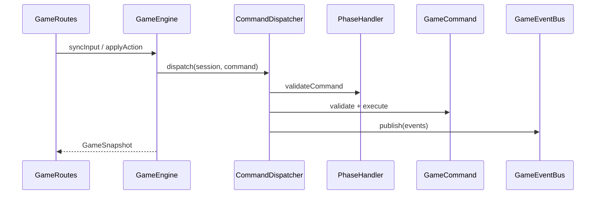

# Архитектура game-service (движок)

## Слои

```text
api/              HTTP (Ktor), только DTO
application/      GameEngine — сессии, фасад для API
domain/           правила без фреймворков
  session/        GameSession
  command/        Command, CommandDispatcher
  phase/          State: PhaseHandler, PhaseRegistry
  event/          Observer: GameEvent, GameEventBus
  level/          LevelGenerator (порт)
  ai/             Strategy: MobBehavior (заготовка)
infrastructure/   адаптеры: TestLevelGenerator, LevelGeneratorFactory
```

## Паттерны

| Паттерн | Где |
|---------|-----|
| **Command** | `SyncInputCommand`, `LegacyMovementCommand`, `CommandRegistry`, `CommandDispatcher` |
| **State** | `PhaseHandler`, `SessionPhase`, `PhaseRegistry` |
| **Strategy** | `MobBehavior` (+ реализации позже) |
| **Factory** | `LevelGeneratorFactory` |
| **Observer** | `GameEventBus`, `GameEventListener` |

## Поток запроса



## Расширение

- Новое действие: класс `GameCommand` + одна строка в `CommandRegistry.defaultBuilder()` (`register("attack") { … }`).
- Новая фаза: `PhaseHandler` + запись в `PhaseRegistry.defaultHandlers()`.
- Процген: `LevelGenerator` + ветка в `LevelGeneratorFactory`.
- Мобы: `MobBehavior` в `CombatSystem` (будущий пакет `domain/combat`).

`shared` — только то, что нужно клиенту: `TileMap`, DTO, `SessionPhase`, движение FPS.
