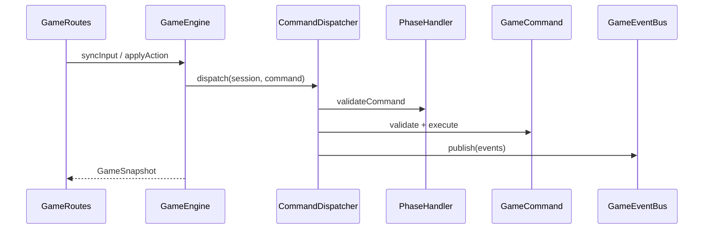

# Архитектура game-service (движок)

## Слои

```text
api/              HTTP (Ktor), только DTO
application/      GameEngine — сессии, фасад для API
domain/           правила без фреймворков
  session/        GameSession, RoomEngagementSystem
  command/        Command, CommandDispatcher, CommandRegistry
  phase/          State: PhaseHandler, PhaseRegistry
  event/          Observer: GameEvent, GameEventBus
  combat/         бой, мобы, урон
  ai/             Strategy: MobBehavior
  level/          LevelGenerator (порт)
infrastructure/   адаптеры: TestLevelGenerator, LevelGeneratorFactory, AgentRunnerMobClient
```

## Паттерны

| Паттерн | Где |
|---------|-----|
| **Command** | `SyncInputCommand`, `LegacyMovementCommand`, `CommandRegistry`, `CommandDispatcher` |
| **State** | `PhaseHandler`, `SessionPhase`, `PhaseRegistry` |
| **Strategy** | `MobBehavior` — `RusherBehavior`, `ShooterBehavior`, `LlmGuardBehavior` |
| **Factory** | `LevelGeneratorFactory` |
| **Observer** | `GameEventBus`, `GameEventListener` |

## Поток запроса



## Расширение

- Новое действие: класс `GameCommand` + регистрация в `CommandRegistry.defaultBuilder()`.
- Новая фаза: `PhaseHandler` + запись в `PhaseRegistry.defaultHandlers()`.
- Процген: `LevelGenerator` + ветка в `LevelGeneratorFactory`.
- Новый тип моба: реализация `MobBehavior` + wiring в `MobSpawner` / `CombatSystem`.

`shared` — DTO, `TileMap`, `SessionPhase`, FPS-движение, протокол MCP; общие типы агентов (`AgentConfig`, MCP tool schemas) — для `agent-runner` и `policy-agent-runner`.
